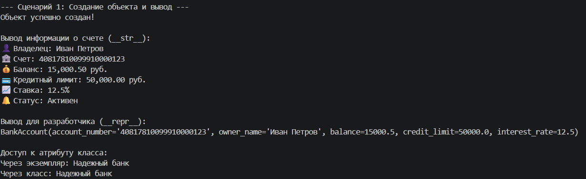
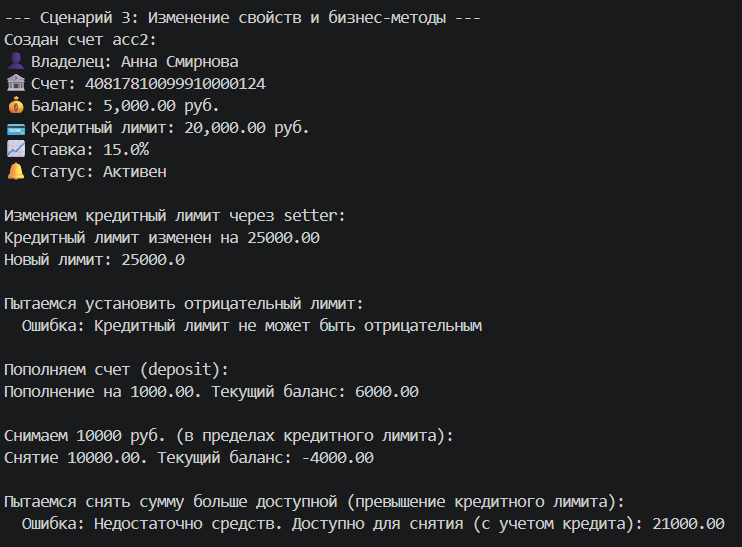
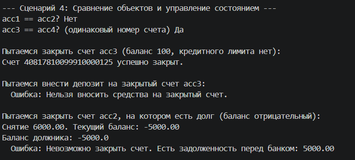
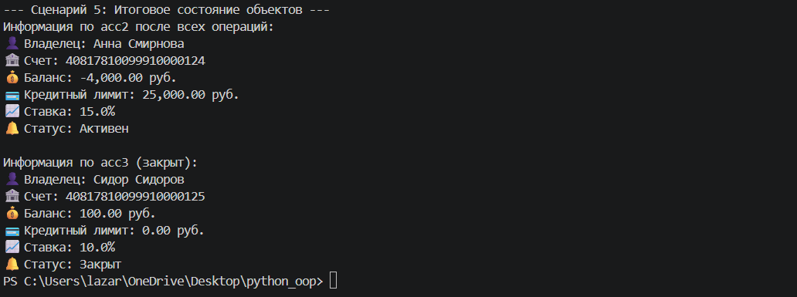

# Лабораторная работа №1
## Выбранная предметная область

Банковская система

Реализованный класс: BankAccount

### Краткое описание процесса 

Класс был выбран из предметной области банковской системы как базовая сущность — банковский счёт (BankAccount). При разработке ориентировалась на реальные характеристики счёта: номер счёта, владелец, баланс, кредитный лимит, процентная ставка и статус активности. Сразу заложила инкапсуляцию через закрытые поля (с префиксом _) и добавила валидацию, чтобы объект нельзя было создать или изменить в некорректном состоянии. Логику проверок вынесла в отдельный модуль validate.py для удобства и переиспользования. Далее добавила бизнес-методы, отражающие реальные банковские операции (пополнение, снятие, закрытие счёта), и ввела состояние is_active, чтобы показать зависимость поведения от данных.

### Краткое описание класса

BankAccount - это класс, представляющий банковский счет. Содержит поля:

1. account_number — номер счёта (строка)
2. owner_name — имя владельца (строка)
3. balance — текущий баланс (число)
4. credit_limit — кредитный лимит (число)
5. interest_rate — процентная ставка (число от 0 до 100)
6. is_active — статус активности счёта (булево значение)

### Методы класса:

- deposit(amount) — пополняет счёт на указанную сумму
- withdraw(amount) — снимает средства с учётом кредитного лимита
- close_account() — закрывает счёт (только при отсутствии долга)

### Магические методы:

- __str__ — строковое представление
- __repr__ — техническое представление для разработчиков
- __eq__ — сравнение объектов по номеру счёта

### Модуль валидации:

Содержит функции для проверки корректности данных:
- validate_owner_name() — только буквы и пробелы
- validate_balance() — неотрицательное число
- validate_credit_limit() — неотрицательное число
- validate_interest_rate() — от 0 до 100
- validate_account_number() — непустая строка

### Демонстрация работы:

#### Сценарий 1. Базовая работа с объектом

- Создание счёта
- Вывод через print() (магический метод __str__)
- Вывод через repr() (магический метод __repr__)
- Доступ к атрибуту класса bank_name

Что демонстрируется:
- __str__
- __repr__
- свойства класса и экземпляра

#### Сценарий 2. Валидация данных
- Попытка создать счёт с отрицательным балансом
- Попытка создать счёт с именем, содержащим цифры

Что демонстрируется:
- проверки типов и диапазонов
- работа try/except
- перехват ValueError

#### Сценарий 3. Бизнес-логика (операции со счётом)
- Изменение кредитного лимита через setter
- Пополнение счёта (deposit)
- Снятие средств в пределах кредитного лимита (withdraw)
- Ошибка при превышении доступных средств

Что демонстрируется:
- работа setter'а с валидацией
- уменьшение баланса при снятии
- увеличение баланса при пополнении
- контроль кредитного лимита

#### Сценарий 4. Логическое состояние (активность счёта)
- Закрытие счёта с положительным балансом
- Попытка внести депозит на закрытый счёт → ошибка PermissionError
- Попытка закрыть счёт с отрицательным балансом (долгом) → ошибка

Что демонстрируется:
- зависимость поведения от статуса is_active
- защита операций на закрытом счёте
- невозможность закрыть счёт при задолженности

#### Сценарий 5. Изменение свойств и сравнение объектов
- Сравнение объектов с одинаковым номером счёта (__eq__)
- Сравнение разных объектов
- Итоговый вывод состояния объектов после всех операций

Что демонстрируется:
- __eq__
- сохранение состояния объектов
- неизменность закрытых полей

