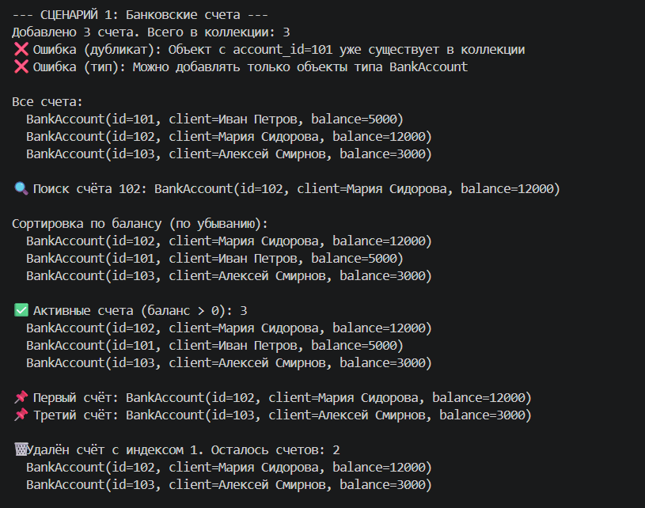
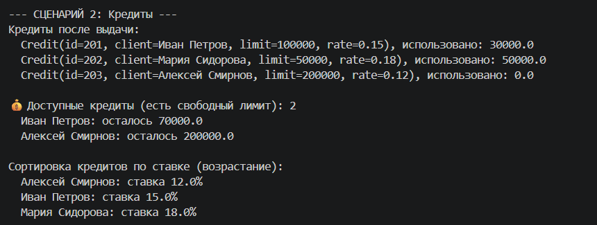
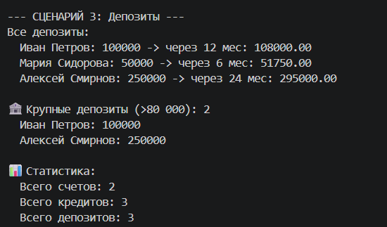

# Лабораторная работа №2
## Выбранная предметная область

Банковская система

Реализованный класс: BankAccount

### Описание класса-контейнера BankCollection

Класс BankCollection представляет собой типизированный контейнер для хранения и управления объектами банковской системы (BankAccount, Client, Credit, Deposit, Transaction). Обеспечивает безопасную работу с коллекцией: добавление с проверкой типа и уникальности, удаление, поиск, сортировку, фильтрацию и индексацию.

### Конструктор

__init__(item_type, id_attr)

Создает новую коллекцию для хранения объектов определенного типа.

Параметры:
1. item_type - класс объектов, которые могут храниться в коллекции (например, BankAccount)
2. id_attr - имя атрибута для проверки уникальности (например, "account_id")

Поведение:
~ инициализирует пустой внутренний список self._items
~ запоминает допустимый тип и атрибут идентификатора

### Основные методы

#### add(item)
Добавляет объект в коллекцию с проверкой типа и уникальности.

Параметры:
item — объект допустимого типа

Исключения:
- TypeError — если передан объект неправильного типа
- ValueError — если объект с таким идентификатором уже существует

#### remove(item)
Удаляет объект из коллекции.

Параметры:
- item — объект, который нужно удалить

Исключения:
- ValueError — если объект не найден в коллекции 

#### remove_at(index)
Удаляет объект по индексу.

Параметры:
- index — целое число (индекс удаляемого элемента)

Исключения:
- IndexError — если индекс вне диапазона

#### get_all()
Возвращает копию списка всех объектов.

Возвращает:
list[T] — копия внутреннего списка

### Методы поиска

#### find_by(**kwargs)
Ищет первый объект, соответствующий заданным критериям.

Параметры:
- **kwargs — атрибуты и их значения для поиска (например, account_id=101)

Возвращает:
- объект, если найден
- None, если не найден

#### find_all_by(**kwargs)
Ищет все объекты, соответствующие заданным критериям.

Параметры:
- **kwargs — атрибуты и их значения для поиска

Возвращает:
list[T] — список найденных объектов

### Методы сортировки

#### sort(key, reverse=False)
Сортирует коллекцию по заданному ключу.

Параметры:
- key — функция, возвращающая значение для сравнения
- reverse — обратный порядок сортировки (по умолчанию False)

Возвращает:
None (сортировка выполняется на месте)

#### sort_by_id()
Сортирует коллекцию по идентификатору (атрибут, указанный в id_attr).

#### sort_by_balance()
Сортирует счета по балансу (по убыванию). Предназначен для BankAccount.

### Методы фильтрации

#### filter(predicate)
Возвращает новую коллекцию с элементами, удовлетворяющими условию.

Параметры:
- predicate — функция, принимающая элемент и возвращающая bool

Возвращает:
BankCollection[T] — новая коллекция

#### get_active_accounts()
Возвращает новую коллекцию счетов с положительным балансом. Предназначен для BankAccount.

#### get_available_credits()
Возвращает новую коллекцию кредитов, у которых есть свободный лимит. Предназначен для Credit.

#### get_large_deposits(min_amount)
Возвращает новую коллекцию депозитов с суммой не менее заданной.

Параметры:
- min_amount — минимальная сумма депозита

### Специальные Методы

#### __len__()
Возвращает количество элементов в коллекции.

Использование:
```python
len(collection)
```

#### __iter__()

Позволяет итерировать коллекцию в цикле for.

Использование:
```python
for item in collection:
    print(item)
```

#### __getitem__(index)
Поддерживает индексацию и срезы.

Использование:

```python
first_item = collection[0]
subset = collection[1:3]
```

Исключения:
- IndexError — если индекс вне диапазона
- __repr__()
Возвращает строковое представление коллекции.

### Демонстрация работы:

#### Сценарий 1. Работа со счетами.


#### Сценарий 2. Кредиты


#### Сценарий 3. Депозиты
