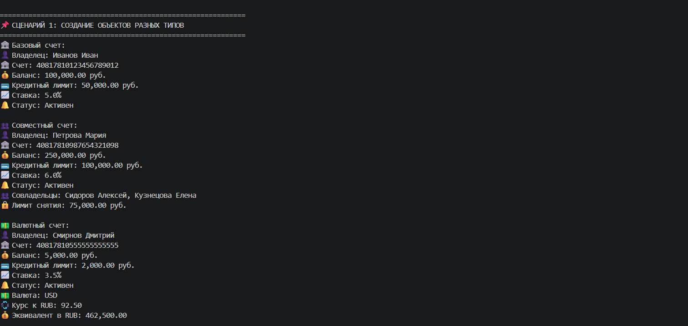
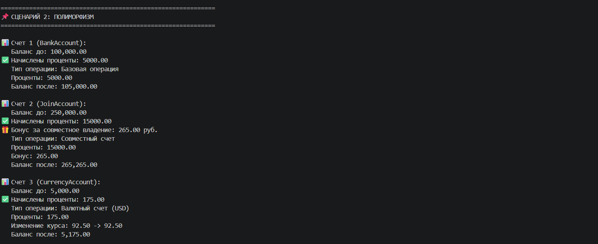
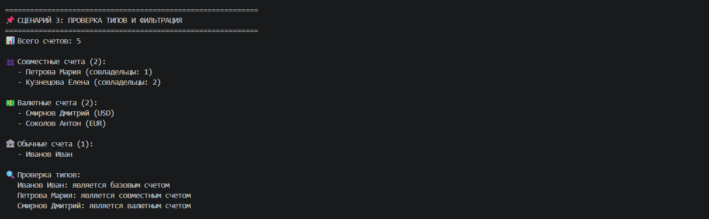
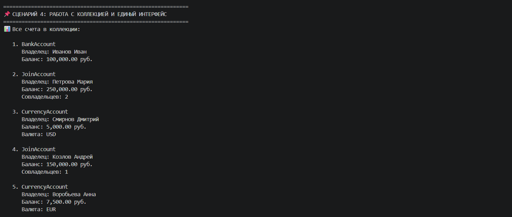
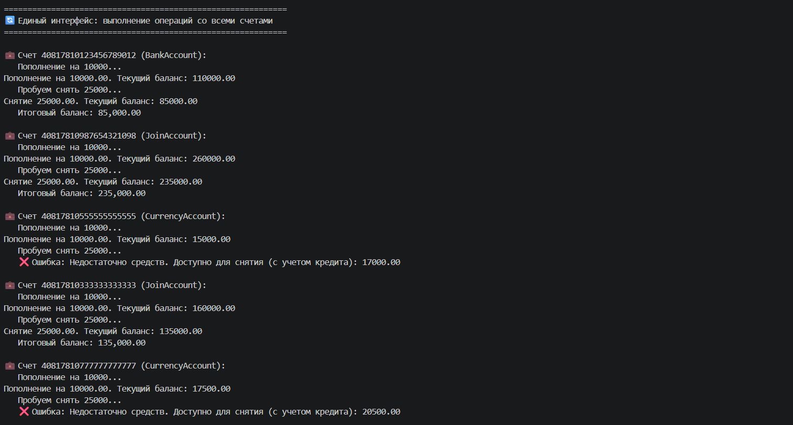
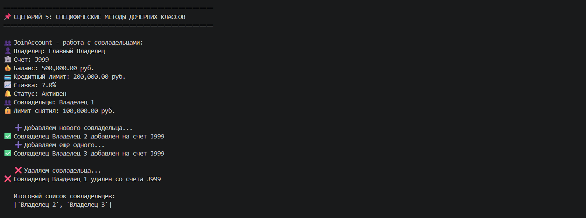
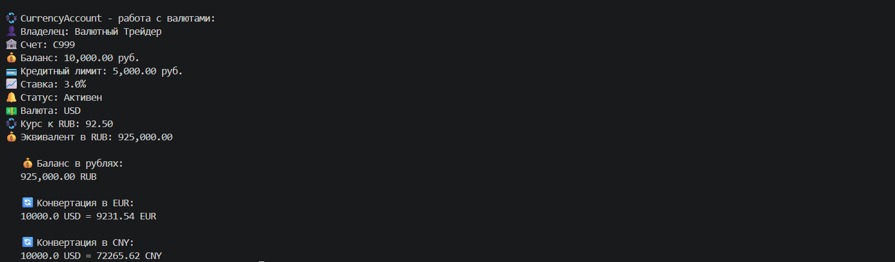

# Лабораторная работа №3
## Выбранная предметная область

Банковская система

Реализованный класс: BankAccount

## Цель работы

Освоить механизм наследования классов, научиться строить иерархию объектов, понять разницу между базовым и производным классами, научиться переиспользовать код и переопределять методы.

## Реализованная иерархия классов

На основе класса BankAccount из лабораторной работы №1 построена следующая иерархия:
BankAccount (Базовый класс)
├── JoinAccount (Совместный счет)
└── CurrencyAccount (Валютный счет)

## Описание реализованной иерархии классов

### Базовый класс: BankAccount

Класс, представляющий базовый банковский счет с основными атрибутами и методами.

**Атрибуты:**
- `account_number` — номер счета (20 цифр)
- `owner_name` — имя владельца
- `balance` — текущий баланс
- `credit_limit` — кредитный лимит
- `interest_rate` — процентная ставка
- `is_active` — статус счета (активен/закрыт)

**Основные методы:**
- `deposit(amount)` — пополнение счета
- `withdraw(amount)` — снятие средств
- `close_account()` — закрытие счета
- `calculate_interest()` — расчет процентов по счету
- `process_monthly()` — ежемесячная обработка счета (единый интерфейс)

### Дочерний класс 1: JoinAccount (Совместный счет)

Счет, предназначенный для нескольких владельцев.

**Новые атрибуты:**
- `co_owners` — список совладельцев счета
- `withdrawal_limit` — лимит снятия для каждого совладельца

**Новые методы:**
- `add_co_owner(new_owner)` — добавление нового совладельца
- `remove_co_owner(owner)` — удаление совладельца

**Переопределенные методы:**
- `withdraw(amount)` — снятие с учетом лимита
- `process_monthly()` — начисление бонуса за количество совладельцев (+0.1% за каждого, максимум +0.5%)
- `__str__()` — добавлена информация о совладельцах и лимите снятия

**Особенности:**
- Нельзя удалить основного владельца счета
- Каждый совладелец ограничен лимитом снятия
- Бонус к процентной ставке за совместное владение

---

### Дочерний класс 2: CurrencyAccount (Валютный счет)

Счет для хранения средств в разных валютах.

**Новые атрибуты:**
- `currency` — валюта счета (USD, EUR, CNY)
- `exchange_rate` — курс к рублю

**Новые методы:**
- `get_balance_in_rub()` — конвертация баланса в рубли
- `convert_to(target_currency)` — конвертация баланса в другую валюту

**Переопределенные методы:**
- `calculate_interest()` — повышенный процент при выгодном курсе
- `process_monthly()` — обновление курса валюты + начисление процентов
- `__str__()` — добавлена информация о валюте и эквиваленте в рублях

**Особенности:**
- Поддерживаются валюты: USD, EUR, CNY
- Автоматическое обновление курса при ежемесячной обработке
- Повышенный процент для USD при курсе ниже 90 рублей

## 5. Демонстрация работы (demo.py)

### Сценарий 1 — Базовое наследование

**Что демонстрируется:**
- создание объектов всех трех классов (BankAccount, JoinAccount, CurrencyAccount)
- использование `super()` в конструкторах дочерних классов
- новые методы дочерних классов (`add_co_owner()`, `remove_co_owner()`, `get_balance_in_rub()`, `convert_to()`)
- методы базового класса (`deposit()`, `withdraw()`)
- переопределенный метод `__str__()` для каждого класса

**Результат:**

### Сценарий 2 — Полиморфизм

**Что демонстрируется:**
- полиморфное поведение метода `process_monthly()` — разная логика обработки для разных типов счетов
- проверка типов через `isinstance()`
- интеграция с коллекцией (список счетов из разных классов)

**Результат:**

### Сценарий 3 — Фильтрация коллекции по типу

**Что демонстрируется:**
- хранение объектов разных типов в одной коллекции (списке)
- фильтрация по типу (выборка только JoinAccount, только CurrencyAccount)
- выборка активных счетов (не закрытых)
- полиморфное поведение на отфильтрованных коллекциях

**Результат:**

### Сценарий 4 — Полиморфизм без условий (Good-паттерн)

**Что демонстрируется:**
- единый интерфейс через метод `process_monthly()`
- отсутствие анти-паттерна `if type == ...`
- полиморфизм методов `calculate_interest()` и `__str__()`
- все объекты обрабатываются единообразно через общий интерфейс

**Результат:**

### Сценарий 5 — Специфические методы дочерних классов

**Что демонстрируется:**
- уникальные методы `JoinAccount` (управление совладельцами)
- уникальные методы `CurrencyAccount` (конвертация валют)
- демонстрация работы методов, которых нет в базовом классе

**Результат:**

