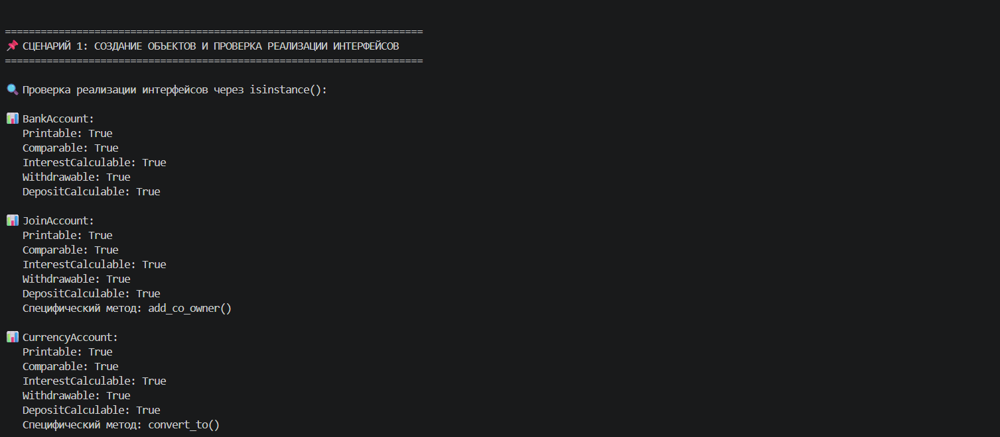
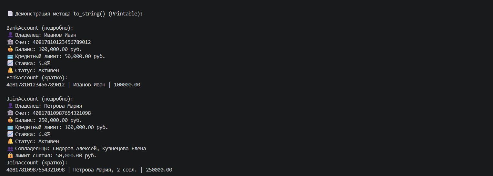
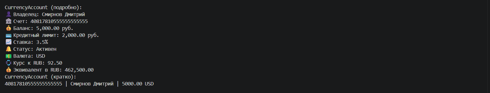
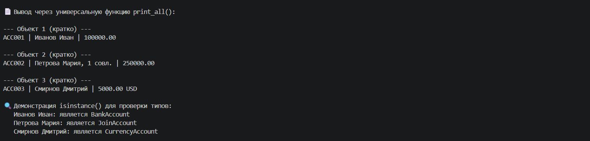
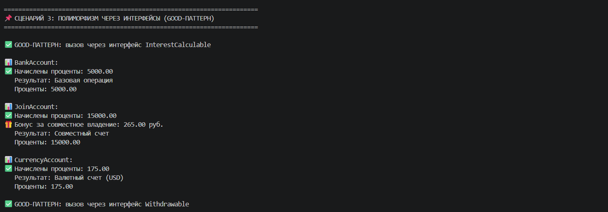
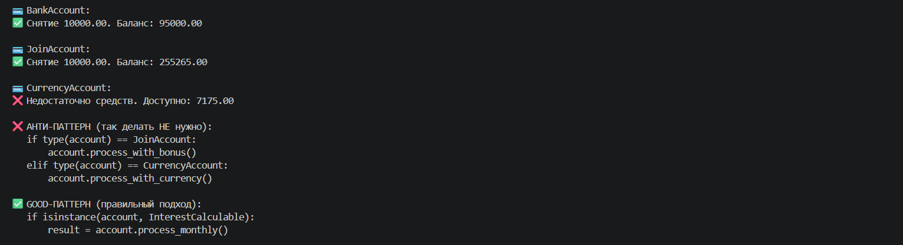
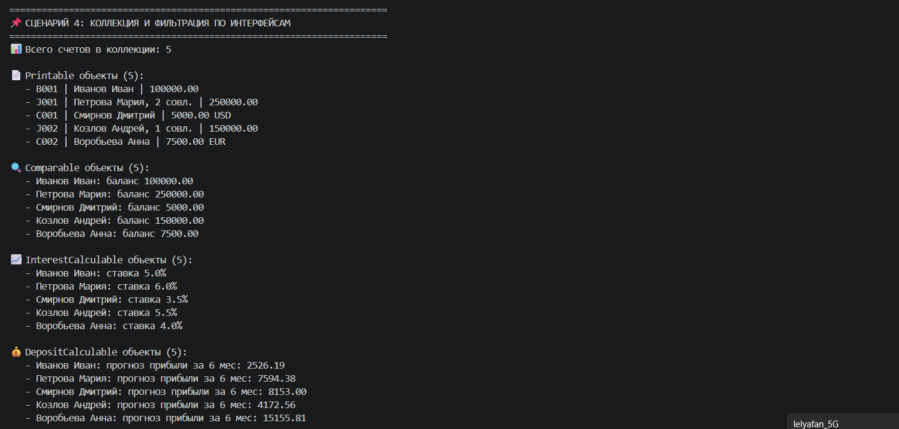
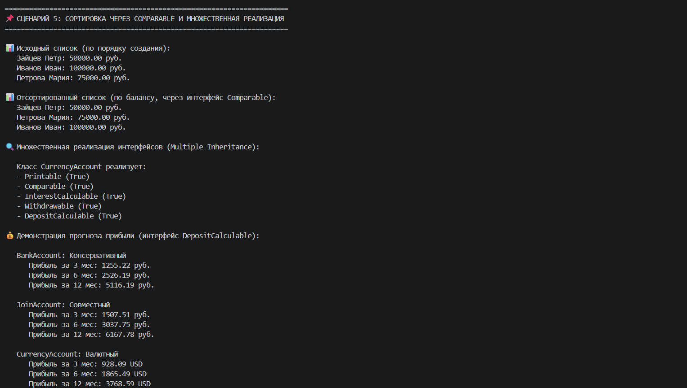

# Лабораторная работа №4

## Цель работы
Познакомиться с абстрактными базовыми классами (ABC), освоить понятие интерфейса (контракта поведения), научиться задавать обязательные методы для классов, закрепить полиморфизм через единый интерфейс, научиться проектировать архитектуру, а не просто классы.

## Выбранная предметная область

**Банковское дело**

## Реализованная система интерфейсов на основе существующих классов

| Интерфейс | Назначение | Абстрактные методы |
|-----------|------------|-------------------|
| **Printable** | Предоставление строкового представления объекта | `to_string(verbose)` |
| **Comparable** | Сравнение объектов между собой | `compare_to(other)` |
| **InterestCalculable** | Работа с процентами по счету | `calculate_interest()`, `process_monthly()` |
| **Withdrawable** | Управление снятием средств | `withdraw(amount)` |
| **DepositCalculable** | Расчет выгодности вклада | `get_profit_forecast(months)` |

## Описание реализованных интерфейсов

### Интерфейс `Printable`

Контракт для объектов, которые могут предоставить строковое представление.

**Реализация в классах:** `to_string(verbose)`

| Класс | Результат |
|-------|-----------|
| **BankAccount** | Владелец: Иван | Счет: 408178... | Баланс: 100000 руб. |
| **JoinAccount** | Владелец: Мария | Совладельцы: 2 чел. | Лимит: 50000 руб. |
| **CurrencyAccount** | Владелец: Дмитрий | Валюта: USD | Эквивалент: 462500 руб. |

### Интерфейс `Comparable`

Контракт для объектов, поддерживающих сравнение.

**Реализация в классах:** `compare_to(other)`

| Класс | Критерий сравнения | Пример |
|-------|-------------------|--------|
| **BankAccount** | Баланс счета | 50000 руб. < 100000 руб. → -1 |
| **JoinAccount** | Количество совладельцев, затем баланс | 1 совл. < 2 совл. → -1 |
| **CurrencyAccount** | Баланс в рублях | 462500 руб. < 925000 руб. → -1 |

### Интерфейс `InterestCalculable`

Контракт для объектов, поддерживающих начисление процентов.

**Реализация в классах (полиморфизм):** `process_monthly()`

| Класс | Особенность |
|-------|-------------|
| **BankAccount** | Стандартное начисление процентов (5%) |
| **JoinAccount** | Бонус +0.1% за каждого совладельца (макс. +0.5%) |
| **CurrencyAccount** | Повышенный процент при курсе USD < 90 руб. |

### Интерфейс `Withdrawable`

Контракт для управления снятием средств.

**Реализация в классах:** `withdraw(amount)`

| Класс | Особенность |
|-------|-------------|
| **BankAccount** | Стандартное снятие с учетом кредитного лимита |
| **JoinAccount** | Дополнительный лимит снятия для совладельцев |
| **CurrencyAccount** | Наследует стандартное поведение |

### Интерфейс `DepositCalculable`

Контракт для расчета выгодности вклада.

**Реализация в классах:** `get_profit_forecast(months)`

| Класс | Особенность |
|-------|-------------|
| **BankAccount** | Простой прогноз по процентной ставке |
| **JoinAccount** | Прогноз с учетом бонуса за совладельцев |
| **CurrencyAccount** | Прогноз с учетом валютного риска |

## Расширение коллекции `BankCollection`

| Метод | Назначение |
|-------|-----------|
| `get_printable()` | Возвращает все счета, реализующие `Printable` |
| `get_comparable()` | Возвращает все счета, реализующие `Comparable` |
| `get_interest_calculable()` | Возвращает все счета, реализующие `InterestCalculable` |
| `get_withdrawable()` | Возвращает все счета, реализующие `Withdrawable` |
| `get_deposit_calculable()` | Возвращает все счета, реализующие `DepositCalculable` |
| `universal_print()` | Массовая печать через интерфейс `Printable` |

## Демонстрация работы (demo.py)

### Сценарий 1 — Интерфейс как тип (полиморфизм)

**Что демонстрируется:**
- Функция `universal_print(items: list[Printable])` принимает любые объекты, реализующие `Printable`
- Отсутствие привязки к конкретным типам счетов
- Единый интерфейс для разных классов

**Результат:**

### Сценарий 2 — Проверка через isinstance()

**Что демонстрируется:**
- Проверка реализации интерфейсов у объектов разных типов
- Множественная реализация интерфейсов (один объект реализует 5 интерфейсов)
- Вызов методов через интерфейс

**Результат:**

### Сценарий 3 — Интеграция с коллекцией

**Что демонстрируется:**
- Фильтрация коллекции по интерфейсу (`get_printable()`, `get_comparable()`, `get_interest_calculable()`)
- Сортировка через `Comparable` (разные критерии для разных типов)
- Массовая печать через единый интерфейс

**Результат:**

### Сценарий 4 — Полиморфизм без isinstance (Good-паттерн)

**Что демонстрируется:**
- Сравнение "плохого" подхода (проверка конкретных типов) и "хорошего" (работа через интерфейс)
- Преимущество интерфейсного подхода: код не требует изменений при добавлении новых классов
- Единая функция `process_monthly_interface()` работает с любыми `InterestCalculable`

**Результат:**

### Сценарий 5 — Множественная реализация интерфейсов

**Что демонстрируется:**
- Один класс может реализовывать все 5 интерфейсов одновременно
- Демонстрация работы каждого интерфейса на одном объекте
- Разное поведение методов из одного интерфейса в разных классах

**Результат:**

