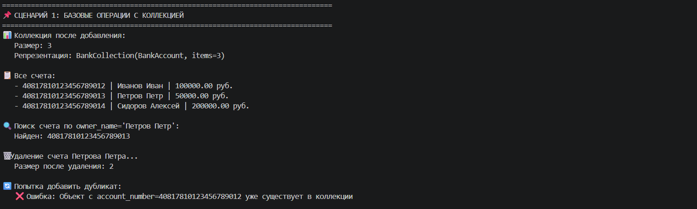
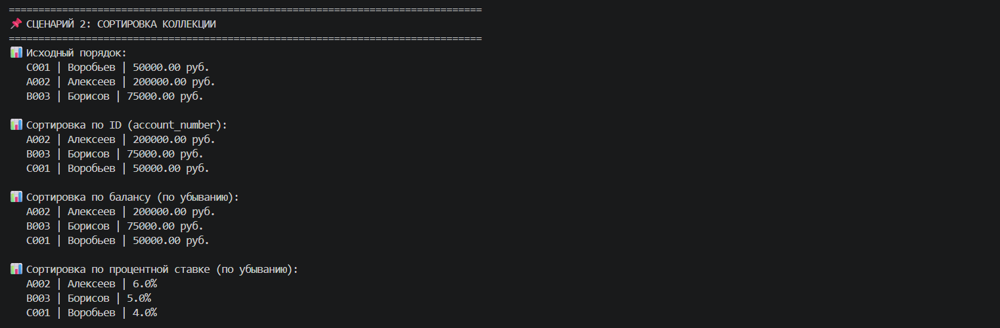
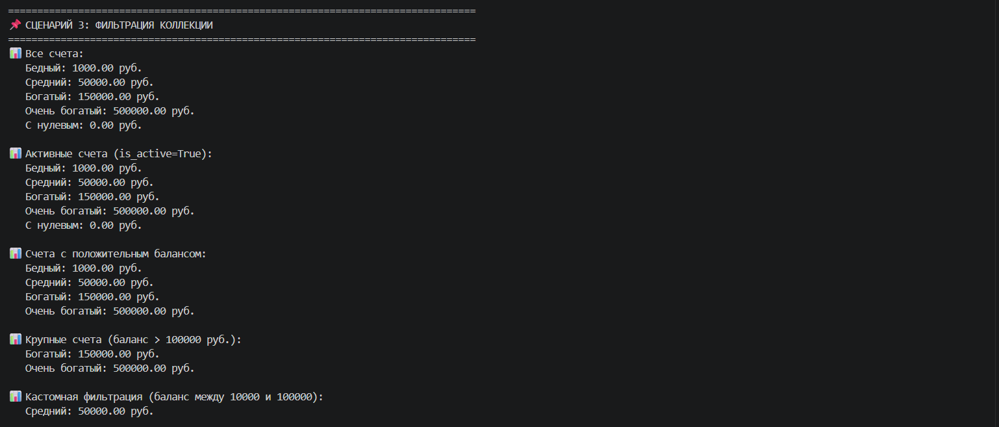
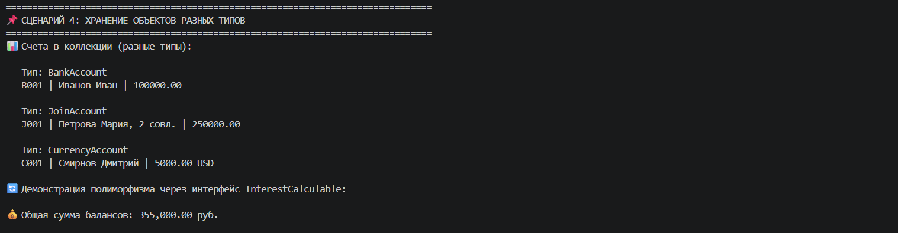
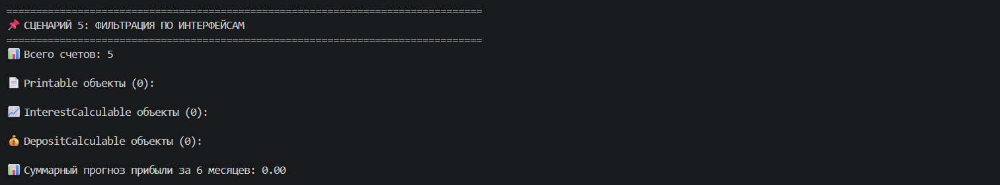

# Лабораторная работа №5

## Цель работы

Изучить обобщенные коллекции (Generic), освоить передачу функций как аргументов, реализовать паттерн «Стратегия» через callable-объекты, научиться строить цепочки операций (Fluent Interface) и применять функции высшего порядка для работы с коллекциями.

## Выбранная предметная область

**Банковское дело** 

## Реализованные функции-стратегии и обработчики

### Сортировка

| Функция/Стратегия | Назначение |
|------------------|------------|
| `by_balance(item)` | Сортировка по балансу счета |
| `by_owner_name(item)` | Сортировка по имени владельца |
| `by_interest_rate(item)` | Сортировка по процентной ставке |
| `by_balance_then_name(item)` | Составная сортировка (баланс → имя) |
| `by_credit_limit(item)` | Сортировка по кредитному лимиту |

### Фильтрация

| Функция/Стратегия | Назначение |
|------------------|------------|
| `is_active(item)` | Активные счета |
| `is_positive_balance(item)` | Счета с положительным балансом |
| `has_high_balance(item)` | Счета с высоким балансом (> 100000 руб.) |
| `has_low_balance(item)` | Счета с низким балансом (< 10000 руб.) |
| `is_join_account(item)` | Совместные счета |
| `is_currency_account(item)` | Валютные счета |

### Преобразование

| Функция/Стратегия | Назначение |
|------------------|------------|
| `extract_owner_name(item)` | Извлечение имени владельца |
| `extract_balance(item)` | Извлечение баланса |
| `to_short_string(item)` | Короткое строковое представление |
| `apply_interest_rate(item)` | Применение процентной ставки |

### Фабрики функций (замыкания)

| Фабрика | Назначение |
|---------|------------|
| `make_balance_filter(min_balance)` | Создает фильтр по минимальному балансу |
| `make_interest_rate_filter(min_rate)` | Создает фильтр по минимальной ставке |
| `make_discount_applier(discount_percent)` | Создает функцию применения скидки |

---

## Описание реализованных концепций

### Передача функций как аргументов

Методы `sort_by(key_func)` и `filter_by(predicate)` в классе `BankCollection` принимают функции-стратегии для динамического изменения поведения.

# Сортировка по переданной стратегии
collection.sort_by(by_balance)
collection.sort_by(by_owner_name)

# Фильтрация по переданному предикату
collection.filter_by(is_active)
collection.filter_by(has_high_balance)

### Функции высшего порядка

| Функция | Назначение | Пример |
|---------|------------|--------|
| `map()` | Преобразование коллекции | `map(lambda x: x.balance, accounts)` |
| `filter()` | Фильтрация коллекции | `filter(lambda x: x.balance > 0, accounts)` |
| `sorted()` | Сортировка с ключом | `sorted(accounts, key=lambda x: x.balance)` |

# Пример map() - извлечение имен
names = list(map(lambda acc: acc.owner_name, accounts))

# Пример filter() - только активные счета
active = list(filter(lambda acc: acc.is_active, accounts))

# Пример sorted() - сортировка по балансу
sorted_accounts = sorted(accounts, key=lambda acc: acc.balance, reverse=True)

### Lambda-выражения

| Использование | Пример |
|---------------|--------|
| Сортировка | `collection.sort_by(lambda x: x.balance, reverse=True)` |
| Фильтрация | `list(filter(lambda x: x.balance > 50000, accounts))` |
| Преобразование | `list(map(lambda x: x.owner_name, accounts))` |
| Составной ключ | `collection.sort_by(lambda x: (x.balance, x.owner_name))` |

### Фабрики функций (замыкания)

| Фабрика | Назначение | Пример вызова |
|---------|------------|---------------|
| `make_balance_filter(min_balance)` | Создает фильтр по минимальному балансу | `make_balance_filter(100000)` |
| `make_interest_rate_filter(min_rate)` | Создает фильтр по минимальной ставке | `make_interest_rate_filter(5.0)` |
| `make_discount_applier(discount_percent)` | Создает функцию применения скидки | `make_discount_applier(10)` |

### Паттерн «Стратегия» через callable-объекты

| Класс-стратегия | Метод | Возвращает |
|-----------------|-------|------------|
| `SortByBalanceStrategy` | `__call__(account)` | `account.balance` |
| `SortByNameStrategy` | `__call__(account)` | `account.owner_name` |
| `SortByCompositeStrategy` | `__call__(account)` | `(account.balance, account.owner_name)` |
| `HighBalanceFilterStrategy` | `__call__(account)` | `account.balance >= threshold` |
| `ActiveFilterStrategy` | `__call__(account)` | `account.is_active` |

### Цепочки операций (Fluent Interface)

| Метод цепочки | Действие | Возвращает |
|---------------|----------|------------|
| `filter_by(predicate)` | Фильтрация элементов по условию | `self` |
| `sort_by(key_func, reverse)` | Сортировка элементов по ключу | `self` |
| `apply(func)` | Применение функции к каждому элементу | `self` |
| `map_to(func)` | Преобразование элементов в новый список | `list` |
| `get_result()` | Получение итогового списка | `list` |
| `to_collection()` | Преобразование обратно в коллекцию | `BankCollection` |

### Методы расширения коллекции `BankCollection`

| Метод | Назначение | Пример |
|-------|------------|--------|
| `sort_by(key_func, reverse)` | Сортировка по ключевой функции | `collection.sort_by(lambda x: x.balance)` |
| `filter_by(predicate)` | Фильтрация по предикату | `collection.filter_by(lambda x: x.balance > 0)` |
| `apply(func)` | Применение функции ко всем элементам | `collection.apply(lambda x: x.balance * 0.9)` |
| `map_to(func)` | Преобразование в список результатов | `names = collection.map_to(lambda x: x.owner_name)` |
| `copy()` | Создание поверхностной копии | `new_col = collection.copy()` |
| `deep_copy()` | Создание глубокой копии | `new_col = collection.deep_copy()` |
| `filter_and_sort(predicate, key_func)` | Комбинированная фильтрация и сортировка | `collection.filter_and_sort(is_active, by_balance)` |

## Демонстрация работы (demo.py)

### Сценарий 1 — Функции сортировки и фильтрации

**Что демонстрируется:**
- стратегии сортировки: по балансу, по имени владельца, по процентной ставке
- функции фильтрации: активные счета, положительный баланс, высокий баланс
- встроенная функция `filter()` с lambda и именованными функциями

**Результат:**

### Сценарий 2 — map(), lambda и фабрика функций

**Что демонстрируется:**
- функция `map()` с именованными функциями и lambda
- lambda-выражения в сортировке, фильтрации и преобразовании
- фабрика функций `make_balance_filter()` для создания фильтров

**Результат:**

### Сценарий 3 — Паттерн Стратегия (callable-объекты)

**Что демонстрируется:**
- callable-объекты: `SortByBalanceStrategy`, `SortByNameStrategy`
- callable-объекты: `HighBalanceFilterStrategy`, `ActiveFilterStrategy`
- метод `apply()` для применения функции ко всем элементам

**Результат:**

### Сценарий 4 — Цепочки операций (Fluent Interface)

**Что демонстрируется:**
- класс `ChainWrapper` для построения цепочек операций
- цепочка: `filter_by()` → `sort_by()` → `map_to()`
- удобный и читаемый синтаксис

**Результат:**

### Сценарий 5 — Комбинированные операции и исключения

**Что демонстрируется:**
- метод `filter_and_sort()` — комбинированная операция
- передача lambda как стратегии
- обработка исключений и краевые случаи

**Результат:**

## Сравнение подходов

### Lambda vs Named Function

| Подход | Пример | Когда использовать |
|--------|--------|---------------------|
| Lambda | `collection.sort_by(lambda x: x.balance)` | Для простых, одноразовых операций |
| Named function | `def by_balance(x): return x.balance` | Для переиспользуемых стратегий |

### Статическая функция vs Callable-объект

| Подход | Пример | Преимущества |
|--------|--------|--------------|
| Статическая функция | `def is_high(x): return x.balance > 100000` | Простота |
| Callable-объект | `class HighFilter: __call__(self, x)` | Может хранить состояние |

### Обычный подход vs Fluent Interface

| Подход | Пример |
|--------|--------|
| Обычный подход | `filtered = collection.filter_by(is_active)` `sorted_coll = filtered.sort_by(by_balance)` `result = sorted_coll.map_to(extract_name)` |
| Fluent Interface | `result = (ChainWrapper(collection).filter_by(is_active).sort_by(by_balance).map_to(extract_name).get_result())` |

## Вывод

В ходе выполнения лабораторной работы были изучены и применены на практике следующие концепции:

### Функции как объекты первого класса
- Передача функций в качестве аргументов
- Возврат функций из функций (замыкания)
- Присваивание функций переменным

### Функции высшего порядка
- `map()` — преобразование коллекции
- `filter()` — фильтрация коллекции
- `sorted()` — сортировка с ключом

### Lambda-выражения
- Создание анонимных функций на месте
- Использование в сортировке, фильтрации и преобразовании

### Фабрики функций (замыкания)
- Создание параметризованных функций
- Захват контекста (closure)

### Паттерн «Стратегия»
- Реализация через callable-объекты
- Гибкая подстановка алгоритмов
- Отсутствие изменений в коде коллекции

### Fluent Interface (цепочки операций)
- Построение выразительных цепочек методов
- Комбинирование фильтрации, сортировки и преобразования