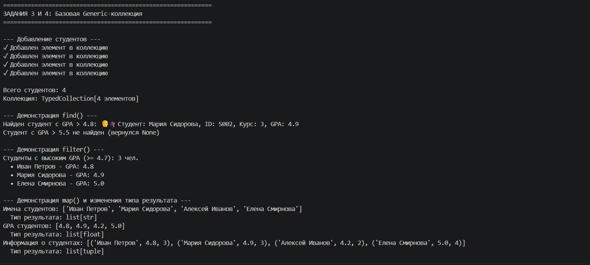
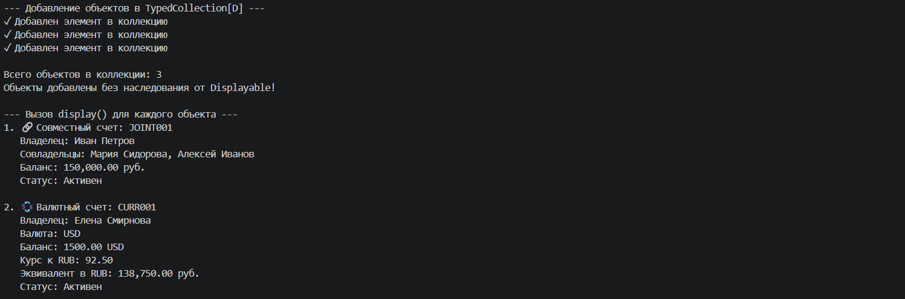
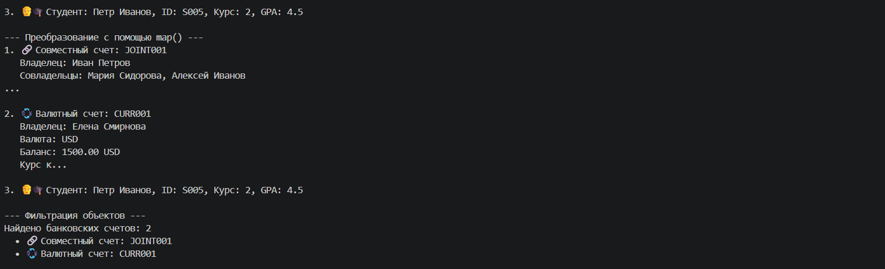
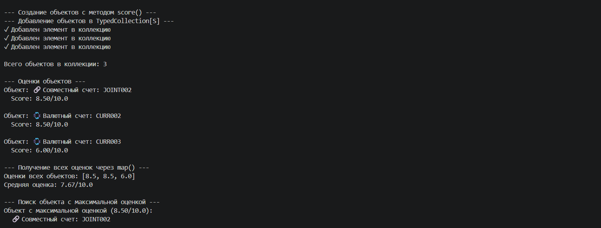
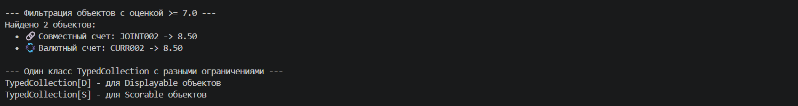

# Лабораторная работа №6 — Generics и typing

## 1. Цель работы

Освоить систему аннотаций типов в Python (typing), научиться создавать обобщённые (generic) классы с помощью `TypeVar` и `Generic`, понять концепцию структурной типизации через `typing.Protocol`.

## 2. Реализованные Generic-классы и протоколы

| Категория | Класс/Протокол | Назначение |
|-----------|----------------|------------|
| Generic-коллекция | `TypedCollection[T]` | Обобщённая коллекция с поддержкой типов |
| TypeVar | `T` | Базовый тип для элементов коллекции |
| TypeVar | `R` | Тип результата для метода `map()` |
| TypeVar | `D` | Ограничен протоколом `Displayable` |
| TypeVar | `S` | Ограничен протоколом `Scorable` |
| Протокол | `Displayable` | Объекты с методом `display() -> str` |
| Протокол | `Scorable` | Объекты с методом `score() -> float` |

## 3. Описание реализованных концепций

### Generic-классы и TypeVar

Класс `TypedCollection[T]` — обобщённая коллекция, которая может хранить элементы только одного типа `T`. Это аналог коллекции из ЛР-2, но с полной поддержкой типизации.

**Использование:**
int_collection: TypedCollection[int] = TypedCollection()
str_collection: TypedCollection[str] = TypedCollection()
product_collection: TypedCollection[Product] = TypedCollection()

### Generic-методы с дополнительным TypeVar

Метод map() принимает функцию преобразования и может менять тип элементов.

**Использование:**
products: TypedCollection[Product] = TypedCollection()
names: list[str] = products.map(lambda p: p.name)
prices: list[float] = products.map(lambda p: p.price)

### Функциональные методы

Три ключевых метода для функциональной обработки коллекций:
| Метод | Назначение | Возвращаемый тип |
|--------|--------|---------------------|
| find (predicate) | Поиск первого подходящего элемента | Optional[T] |
| filter(predicate) | Фильтрация с возвратом новой коллекции | List[T] |
| map(transform) | Преобразование с возможной сменой типа | List[R] |

### Протоколы (структурная типизация)

Протоколы определяют "контракт" — набор методов, которые должен иметь объект. Класс не обязан наследоваться от протокола явно — достаточно просто реализовать нужные методы.

class Displayable(Protocol):
    def display(self) -> str: ...

class Scorable(Protocol):
    def score(self) -> float: ...

TypeVar с ограничением на протоколы:

D = TypeVar('D', bound=Displayable)
S = TypeVar('S', bound=Scorable)

Важно: Классы не наследуются от Displayable или Scorable! Это работает благодаря структурной типизации.

### Monkey patching
Методы display() и score() добавлены к существующим классам JoinAccount и CurrencyAccount через динамическое присвоение, не изменяя исходные файлы ЛР-3.

**Использование:**
JoinAccount.display = join_account_display
JoinAccount.score = join_account_score
CurrencyAccount.display = currency_account_display
CurrencyAccount.score = currency_account_score

## Демонстрация

### Сценарий 1 - Базовая Generic-коллекция 
Что демонстрируется:
- Создание типизированной коллекции TypedCollection[Student]
- Добавление, удаление и поиск элементов
- Демонстрация методов find(), filter(), map()
- Изменение типа результата при использовании map()

### Сценарий 2 - Протокол Displayable
Что демонстрируется:
- Коллекция TypedCollection[D] принимает любые объекты с методом display()
- Объекты JoinAccount, CurrencyAccount, Student подходят под протокол
- Ни один класс не наследуется от Displayable явно — структурная типизация
- Вызов display() для каждого объекта безопасен благодаря bound=Displayable

